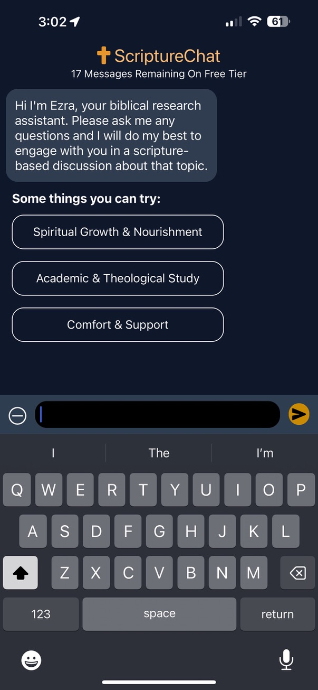
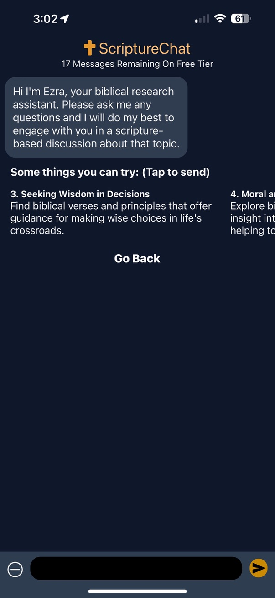
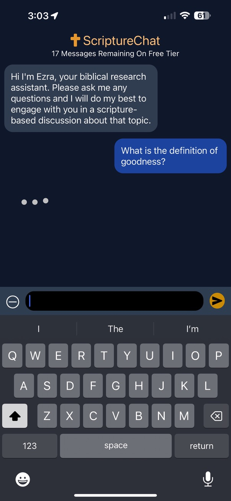
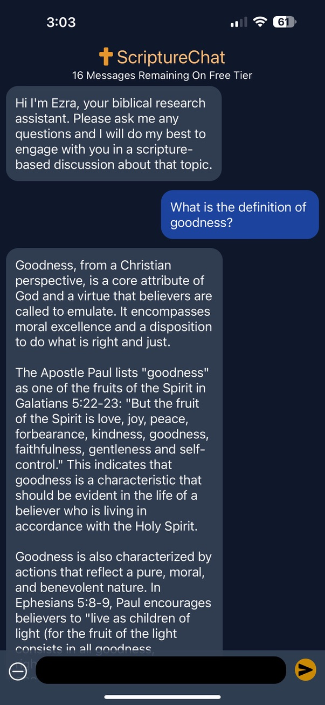

# ScriptureChat - AI-Powered Bible Study Companion

[](https://reactnative.dev/)
[](https://expo.dev/)
[](https://firebase.google.com/)
[](https://www.typescriptlang.org/)

> **The first generative AI-powered Bible study app on iOS (March 2023)**

I built ScriptureChat because I noticed that generative AI could be incredibly powerful for having meaningful conversations about faith and spiritual topics. As someone who values both technology and spirituality, I wanted to create a tool that could help people explore their faith journey through intelligent, scripture-based discussions.

The idea came from seeing how AI was being used for various applications, but I hadn't seen anything focused on spiritual growth and Bible study. I thought - what if we could create an AI companion that actually understands biblical context and can help people dive deeper into their faith?

## 📱 App Demo

_Coming soon - I'll add a demo video showing the AI chat interface and key features_

## 📸 Screenshots

| Main Chat Interface                                                | AI Conversation                                                |
| ------------------------------------------------------------------ | -------------------------------------------------------------- |
|  |  |

| Faith Customization                                                | Settings & Profile                                                |
| ------------------------------------------------------------------ | ----------------------------------------------------------------- |
|  |  |

### App Icon


## What It Does

ScriptureChat is a mobile app that provides an AI-powered companion for Bible study and spiritual reflection. Users can have conversations about scripture, ask questions about faith, and get personalized guidance based on their denomination and spiritual journey.

Key features include:

- **AI Chat**: Intelligent conversations about scripture and faith topics
- **Personalized Experience**: Customizable based on denomination, knowledge level, and spiritual focus
- **Cross-Platform**: Works on both iOS and Android
- **Premium Features**: Advanced customization and unlimited conversations for subscribers

## Tech Stack

- **Frontend**: React Native with Expo for cross-platform development
- **Backend**: Firebase for authentication, database, and analytics
- **AI Integration**: Custom API endpoints for AI-powered conversations
- **State Management**: React Context for app-wide state
- **Styling**: Tailwind CSS for consistent design
- **Payments**: React Native Purchases for subscription management

## Architecture

The app follows a typical React Native architecture with:

- Navigation handled by React Navigation
- State management through Context API
- Firebase integration for backend services
- Custom AI chat components for the core functionality

## What's in This Repo

This repository contains the complete React Native frontend, including:

- All UI components and screens
- Navigation and state management
- Authentication flow
- AI chat interface
- Premium subscription handling
- Platform-specific configurations

## What's Not Included

To protect the core AI functionality and business logic, the following aren't included:

- Backend AI service code
- Database schemas and user data models
- Revenue analytics and tracking
- Server infrastructure

## Getting Started

### Prerequisites

- Node.js 18+
- Expo CLI
- iOS Simulator (for iOS development)
- Android Studio (for Android development)

### Setup

1. **Clone and install**

   ```bash
   git clone https://github.com/yourusername/scripturechat.git
   cd scripturechat
   npm install
   ```

2. **Configure Firebase**
   - Copy `google-services.json.template` to `google-services.json` and add your Firebase project details
   - Copy `GoogleService-Info.plist.template` to `ios/ScriptureChat/GoogleService-Info.plist` and add your Firebase project details
   - Copy `env.template` to `.env` and add your Firebase API keys

3. **Start development**

   ```bash
   npm start
   ```

4. **Run on device/simulator**

   ```bash
   # iOS
   npm run ios

   # Android
   npm run android
   ```

## Code Highlights

### Key Implementation Areas

#### **AI Chat System**

- [`Screens/AI/ChatBot/Fleur.js`](./Screens/AI/ChatBot/Fleur.js) - Main AI chat interface with conversation handling
- [`Context/FleurContext.js`](./Context/FleurContext.js) - Global state management for AI conversations
- [`Components/Message.js`](./Components/Message.js) - Chat message components

#### **Authentication & User Management**

- [`Context/AuthContext.js`](./Context/AuthContext.js) - Firebase authentication with custom hooks
- [`Screens/Login.js`](./Screens/Login.js) - User authentication flow
- [`Screens/Settings.js`](./Screens/Settings.js) - User preferences and account management

#### **Premium Features**

- [`Screens/Paywall2.js`](./Screens/Paywall2.js) - Premium subscription interface
- [`Components/useRevHook.js`](./Components/useRevHook.js) - Revenue tracking and subscription management
- [`Screens/PromoCode.js`](./Screens/PromoCode.js) - Promotional code system

#### **Faith Customization**

- [`Screens/CustomizeFaith.js`](./Screens/CustomizeFaith.js) - Personalization settings
- [`Components/ReflectionCount.js`](./Components/ReflectionCount.js) - Usage tracking

## Features

### 🤖 AI-Powered Bible Study

- **Intelligent Chatbot** - Context-aware conversations about scripture and faith
- **Personalized Responses** - Tailored to denomination, knowledge level, and spiritual focus
- **Conversation Memory** - Persistent session context across interactions
- **Scripture Integration** - Biblical references and theological context

### 🎯 Faith Customization

- **Denomination Settings** - Catholic, Protestant, Orthodox, and more
- **Knowledge Level** - Beginner to advanced biblical understanding
- **Spiritual Focus** - Personal growth, study, counseling, etc.
- **Custom Preferences** - Personalized AI responses

### 💰 Monetization

- **Freemium Model** - Basic features free, premium features subscription-based
- **Subscription Management** - Seamless billing and account management
- **Promotional Codes** - Flexible pricing and marketing campaigns

### 📱 User Experience

- **Intuitive Design** - Clean, accessible interface
- **Haptic Feedback** - Enhanced tactile interactions
- **Offline Support** - Core features available without internet
- **Cross-Platform** - Consistent experience across iOS and Android

## Why I Built This

I've always been interested in how technology can enhance our spiritual lives. When I started exploring generative AI, I realized it could be perfect for creating meaningful faith-based conversations. Most AI applications were focused on productivity or entertainment, but I saw an opportunity to use this technology to help people grow spiritually.

The challenge was building something that felt authentic and genuinely helpful, not just another AI chatbot. I wanted to create an experience that could adapt to different denominations, knowledge levels, and spiritual needs.

## What I Learned

Building ScriptureChat taught me a lot about:

- Integrating AI APIs into mobile apps
- Managing complex conversation state
- Building subscription-based revenue models
- Creating personalized user experiences
- Handling sensitive topics with appropriate AI prompts

## Key Achievements

- **First AI Bible Study App on iOS** (March 2023)
- **Pioneered AI Faith Category** - Established new app category standards
- **Successfully Navigated App Store Review Process** - Set precedent for AI faith applications
- **Commercial Viability Demonstrated** - Proved market demand for AI-powered spiritual guidance

## License

This project is proprietary software. The code is provided for demonstration purposes only.

---

**Built with React Native and a lot of curiosity about AI + faith**

_Pioneering AI-powered Bible study since March 2023_
